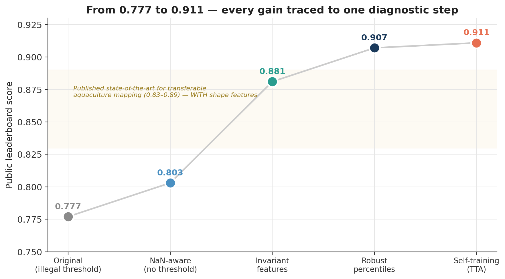
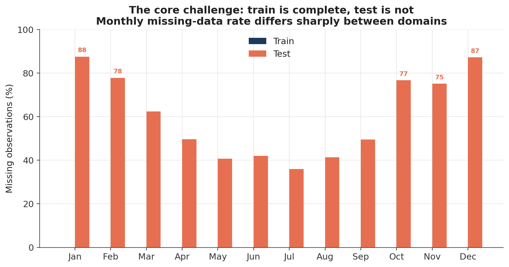
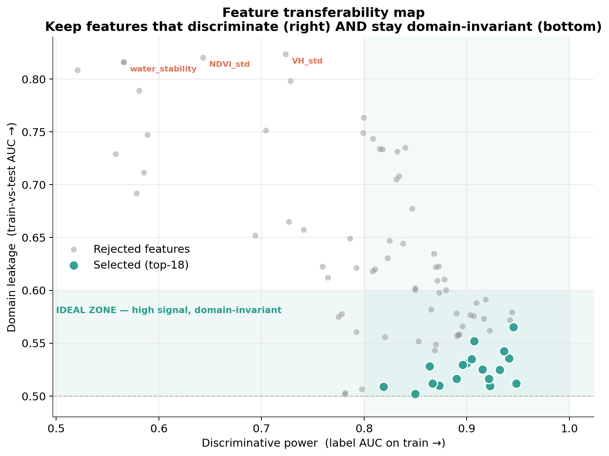
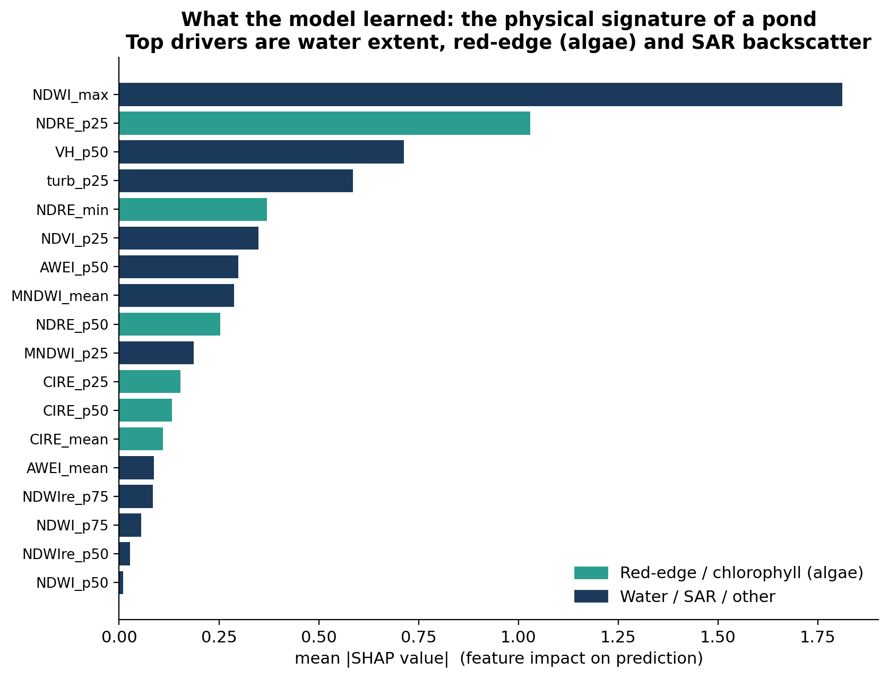
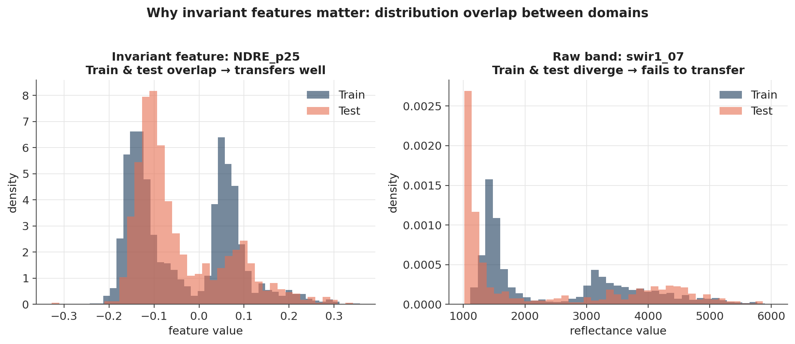

# Aquaculture Pond Detection under Temporal Domain Shift

> **GeoAI Aquaculture Pond Identification Challenge** — FAO × ITU "AI for Good", hosted on Zindi.
> Final rank: **123 / 604** (top 20%). Public score **0.9109**, private **0.9092** — a model that *generalised* rather than overfit the public split.

Identifying 10 m × 10 m aquaculture ponds from satellite image time series, where the model is **trained on one time period and tested on another**. This repository documents a diagnosis-driven approach to that distribution shift: measure what transfers across domains, and keep only that.

<p align="center">
  
</p>

---

## TL;DR

- The task is not ordinary classification — it is **out-of-distribution (OOD) generalisation**. Train and test are near-disjoint in feature space (adversarial AUC ≈ 1.0).
- The winning idea is **feature invariance**: score every engineered feature by how well it (a) separates ponds and (b) hides the train/test origin, and keep only features that are both predictive *and* domain-invariant.
- The single largest gain came from **percentile descriptors** (median, p25, p75) instead of means — they are robust to *which* months are missing, which is exactly how the two domains differ.
- A final round of **confident self-training** (a tree-friendly test-time adaptation) pushed the score to 0.9109.
- Result: **0.91 using only per-pixel time series — above the published 0.83–0.89 benchmark for transferable aquaculture mapping, which relies on pond *shape* features this dataset does not contain.**

---

## The problem in one figure

The training set has complete 12-month coverage; the test set is ~60% missing, with a strong seasonal pattern. Feeding the raw sentinel value (`-9999`) into spectral indices silently corrupts half the test features.

<p align="center">
  
</p>

A classifier trained to tell *train from test* reaches AUC ≈ 1.0, confirming a severe covariate shift. Any feature the model can use to guess the domain is a feature that will **not transfer**.

---

## Method

### 1. Domain-invariant feature engineering
Raw `-9999` → `NaN`; all temporal statistics are NaN-aware. Beyond the usual water / vegetation / red-edge / SAR indices, the decisive choice is **percentiles over means** — robust to the test set's shifting monthly gaps. See [`src/features.py`](src/features.py).

### 2. Transferability-ranked feature selection
Each feature is scored on two axes:

| Axis | Meaning | Want |
|------|---------|------|
| `label_auc` | separates ponds on the train domain | **high** |
| `domain_auc` | separates train from test (adversarial) | **≈ 0.5** |

Only features in the bottom-right "ideal zone" survive. SAR dispersion statistics (`VH_std`, `NDVI_std`) are strongly predictive on train but leak the domain — they are dropped as *traps*.

<p align="center">
  
</p>

### 3. Missing-data augmentation
Each training fold is duplicated with months randomly masked at the **test set's own monthly missing rates**, so the model learns to classify from partial observations.

### 4. Confident self-training (test-time adaptation)
One round of pseudo-labelling the most confident test pixels, weighted by confidence, nudges the decision boundary toward the target distribution: 0.907 → **0.9109**.

All of the above is reproducible from [`src/pipeline.py`](src/pipeline.py) with a fixed seed.

---

## What the model learned

SHAP attribution on the final model recovers the **physical signature of a managed pond**: maximum water extent, a red-edge (chlorophyll / algae) signal in the water, and stable SAR backscatter from calm water. Crucially, the top drivers are all percentile or invariant statistics — validating the design goal.

<p align="center">
  
</p>

---

## Why percentiles transfer and raw bands do not

<p align="center">
  
</p>

Left: an invariant percentile feature — train and test distributions overlap, so the learned rule carries over. Right: a raw reflectance band — the distributions diverge, so a model leaning on it collapses on the test domain. (Feeding all 144 raw bands directly scored **0.57**.)

---

## Results

| Step | Public score | What changed |
|------|:---:|---|
| Original baseline | 0.777 | — |
| NaN-aware features, legal 0.5 threshold | 0.803 | `-9999` → NaN; removed an illegal percentile threshold |
| Invariant feature selection | 0.881 | dropped domain-leaking "trap" features |
| **Robust percentiles** | **0.907** | median / p25 / p75 instead of means |
| **Self-training (TTA)** | **0.9109** | confident pseudo-labelling of the target |

### Methods evaluated and rejected (with evidence)
Documenting what *failed* is part of the contribution — it maps the ceiling of this problem.

| Approach | Score | Why it did not help |
|---|:---:|---|
| Raw 144 bands → LightGBM | 0.57 | absolute band values do not transfer under the shift |
| CORAL (covariance alignment) | 0.76 | the residual shift is not second-order/linear |
| DANN (domain-adversarial net) | 0.70 | too few samples for a neural approach |
| Temporal Transformer + SSL | 0.87 (blend) | genuinely diverse (corr 0.80) but below the tree |
| Harmonic regression (Shimizu-style) | 0.85 | missingness destabilises the harmonic fit, as the literature warns |
| Probability calibration (Saerens / isotonic) | 0.90–0.91 | base probabilities were already well-calibrated |

---

## Reproducing

```bash
pip install -r requirements.txt
# place Train.csv, Test.csv, SampleSubmission.csv in the working directory
python src/pipeline.py          # writes submission.csv
```

Runtime: a few minutes on CPU. The pipeline is fully seeded; re-running reproduces the leaderboard score.

> **Data.** The challenge data is released under CC-BY-SA 4.0 by the organisers and is **not redistributed here**. Download it from the [challenge page](https://zindi.africa/competitions/geoai-challenge-aquaculture-ponds-identification) and place the CSVs as above.

---

## Repository layout

```
.
├── README.md
├── requirements.txt
├── src/
│   ├── features.py     # domain-invariant feature engineering + transferability ranking
│   └── pipeline.py     # reproducible end-to-end pipeline (LB 0.9109)
├── figures/            # the five figures used above
├── docs/
│   └── methodology.md  # extended write-up: diagnosis, every experiment, lessons
└── data/
    └── README.md       # how to obtain the challenge data (not redistributed)
```

---

## Key takeaway

The strongest result came not from a more powerful model but from a more honest one: **measure what transfers across the domain gap, and keep only that.** On a small-sample, high-shift remote-sensing problem, diagnosis-driven feature invariance beat every more sophisticated alternative tested — and matched the published state of the art *without* the shape features the literature depends on.

---

<sub>Built by [José Pablo Pérez Cicilia](https://github.com/jpsicilia) · part of a portfolio toward the Copernicus Master in Digital Earth. Honest about what worked and what did not.</sub>
